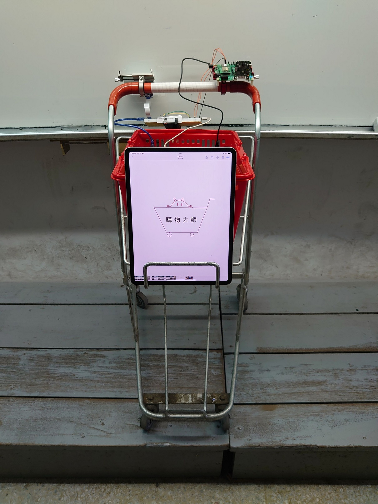
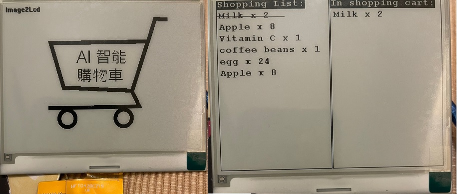
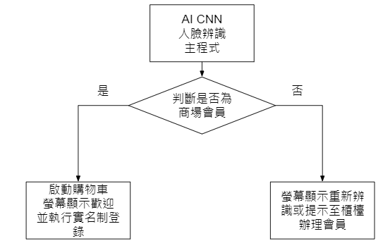
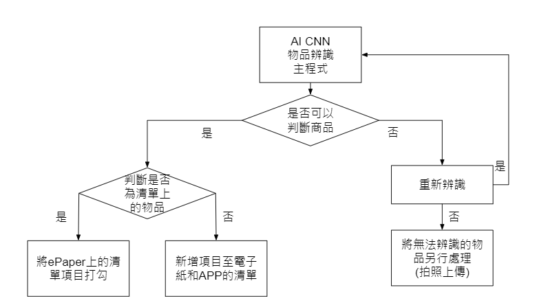

# Shopping Master 購物大師
This is the project design and works for 2022 Synopsys ARC AIoT Design Contest.
#   Introduction
>  系統主要功能包含透過 ARC EM9D AIoT 開發板進行AI人臉辨識，登入會員身分並同時完成實名制登錄後，結合手機APP，讓顧客可以編輯購買備忘清單，上傳至雲端並同步顯示在購物車上的電子紙顯示螢幕供查看，最後透過AI物品辨識和自動結帳的功能，完成無結帳人員接觸並省下排隊的時間。
#  作品照片 Photo
>
>
_ _ _
# 硬體/軟體設定 HW/SW setup
> ### 硬體架構圖 HW Architecture
>

>### 程式流程圖-手機APP 購物清單及結帳
>

>### 軟體架構圖2
>

>### 軟體架構圖3
>
___
# User manual
事先準備

* Tera Term
* EM9D USB線
* VirtualBox
* HMX_FT4222H_GUI

Flashing the image

1. 下載Github上的程式
2. 開啟VirtualBox
3. make和make flash程式
4. EM9D透過USB連接電腦
5. 開啟HMX_FT4222H_GUI，並燒入程式至EM9D
6. 開啟Tera Term
7. 選擇正確的Serial Port(COMx)
8. 更改baud rate 為115200
9. 開始人臉辨識

人臉辨識操作流程

>  透過EM9D來判斷顧客的身分，並透過UART0來傳輸偵測到的顧客名稱到Node MCU，並連接AWS的RDS抓取顧客的購物清單，最後透過Node MCU的TX、RX來傳輸資料給E-paper顯示出來。

